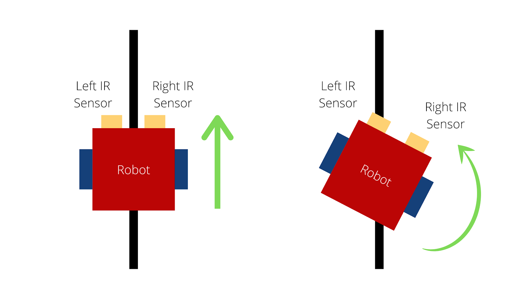

# Line Following Car

An IR sensor can be used to detect the presence of black regions. A vehicle can be made to follow a path of black color with the help of an IR sensor. The ouput from the sensor can be used to correct the course of the vehicle should it deviate from the black path.

## What is... 
### 1. IR sensor (IR emitter plus receiver):
</br>
<p align="left">
  
</p>
</br>
</br>
The IR emitter emits waves in the Infrared spectrum of light. The waves striking black surface are absorbed and no radiation is received on the sensor mainting its resistance high.The waves striking a white surface are reflected back and falls on the receiver which reduces its resistance thereby indicating the presence of white surface.
</br>
The IR sensor outputs a value directly proportional to the amount of radiation detected by the receiver. This ouput can be given as analog input to a microcontroller. 

### 2. PWM
<p>Which stands for pulse width modulation is a process of varying the time for which a pulse remains ON. This way the average power delivered by a signal can be controlled. The longer the pulse remains ON compared to its OFF time, the higher the total power supplied to the load.</p>
<p>Duty cyle represents the proportion of ON time of a pulse to its total time period. It is represented in percentage.</p>
</br>
<p align="left">
  
</p>
</br>
An Arduino uno has 6 PWM output pins (3,5,6,9,10,11) labeled with ~ sign. PWM signals can be given using the in-built function "analogWrite()" in Arduino IDE.
</br>

### 3. L298N
<p>L298N is a dual channel motor driver. The H bridge is used to control the direction of the motors by provding HIGH(1) and LOW(0) signals to the direction control pins (IN1,IN2,IN3,IN4).The speed can be controlled by proving PWM signals to these pins.</p>
<p align="left">
  
</p>

## Components and supplies
<ul>
<li>IR Sensor x 2</li>
<li>Arduino Uno X 1</li>
<li>DC motor(generic) X 4</li>
<li>Jumper wires(generic) X 1</li>
<li>L298N motor driver X 1</li>
<li>USB A to B cable X 1</li>
</ul>

## Working
<p align="left">
  
</p>

<p>The vehicle contains two IR sensors, one each on its left and right side, both facing white surfaces. The sensors ouputs a value whose magnitude is directly proportional to the amount of radiation falling on its receiver. This value is given as input to any of the analog pins of an Arduino. When the vehicle deviates, either of the sensors wil face the black line, which reduces the amount of radiation falling on that sensor which in turn decreases the output to the microcontroller. 
</br>
The microcontroller then sends appropriate signals to the L298N motor driver which drives the motors to turn the vehicle in the other direction till the sensors face white surface again and the vehicle returns to follwoing the black line.

## Code
Code used to program the arduino
<details>
<summary>Click to expand code...</summary>
<p>

```c++
#include "pinsUsed.h"
int ir1_in = 0,ir2_in = 0;

void setup() {
  Serial.begin(9600);
}

// control signals to motors
#include "motorControls.h"

void loop() {
  ir1_in = analogRead(ir1_pin); // read left sensor input
  ir2_in = analogRead(ir2_pin); // read right sensor input

  if(ir1_in<50 && ir2_in<50){ 
    goForward(); // move in straight line 
  }
  else if(ir1_in<50 && ir2_in>50){
    turnRight(); // turn right if right sensor facing black surface
  }
  else if(ir1_in>50 && ir2_in<50){
    turnLeft();// turn left if left sensor facing black surface
  }
}
```

</p>
</details>

## Resources
<ul>
<li>IR Sensor: https://medium.com/illumination/arduino-with-infrared-sensor-48ad4415f320</li>
<li>PWM: https://create.arduino.cc/projecthub/muhammad-aqib/arduino-pwm-tutorial-ae9d71</li>
<li>L298N: https://lastminuteengineers.com/l298n-dc-stepper-driver-arduino-tutorial/</li>
</ul>
