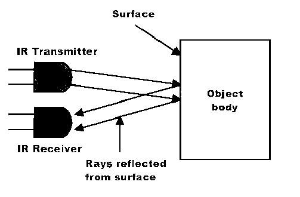

# Line Following Car
A miniature electric vehicle that traverses a given path with the help of IR sensors.

## Working 
### IR sensor (IR transmitter plus receiver):

 
The IR tranmitter transmits waves in the Infrared spectrum of light.
 
The waves on striking dark regions are absorbed while those striking a white region are reflected back.
 
The reflected waves falls upon the receiver thereby indicating the presence of white region.

### IR sensor 